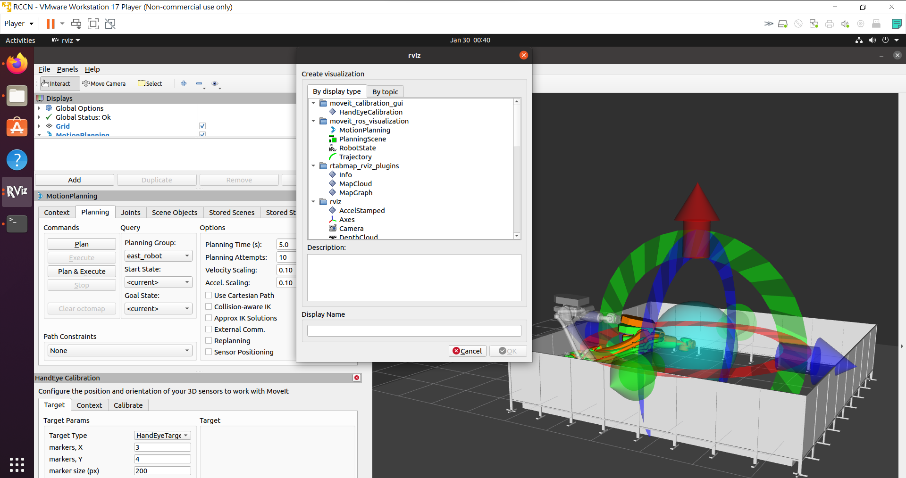
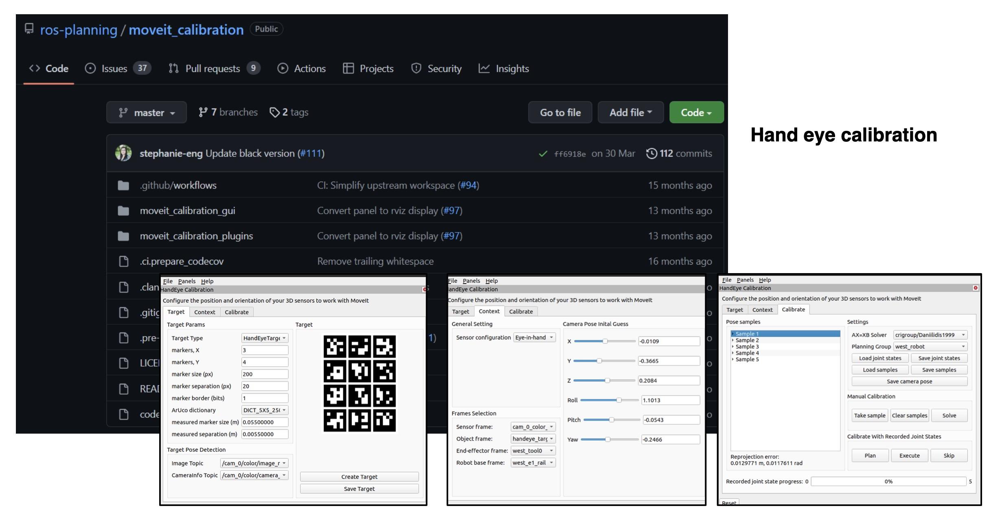
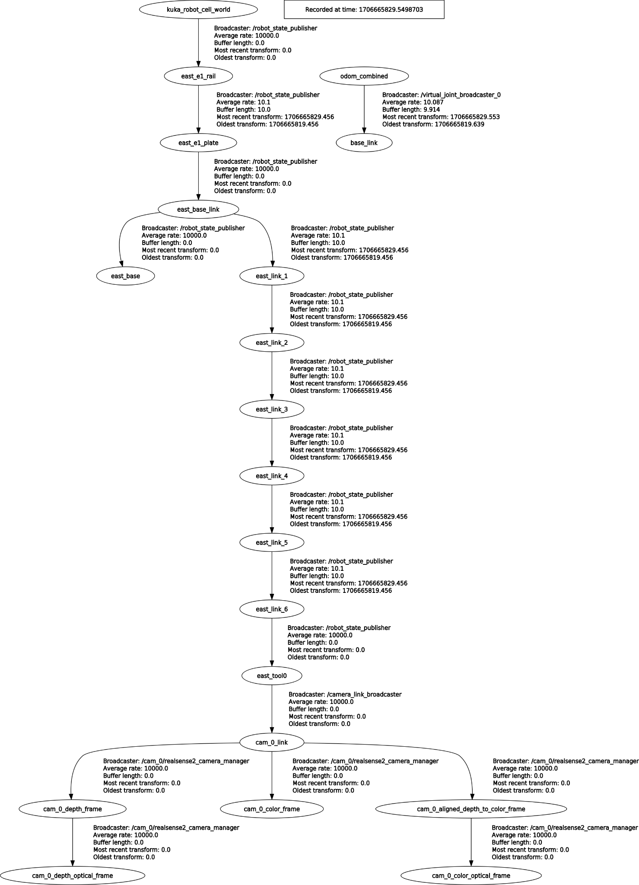
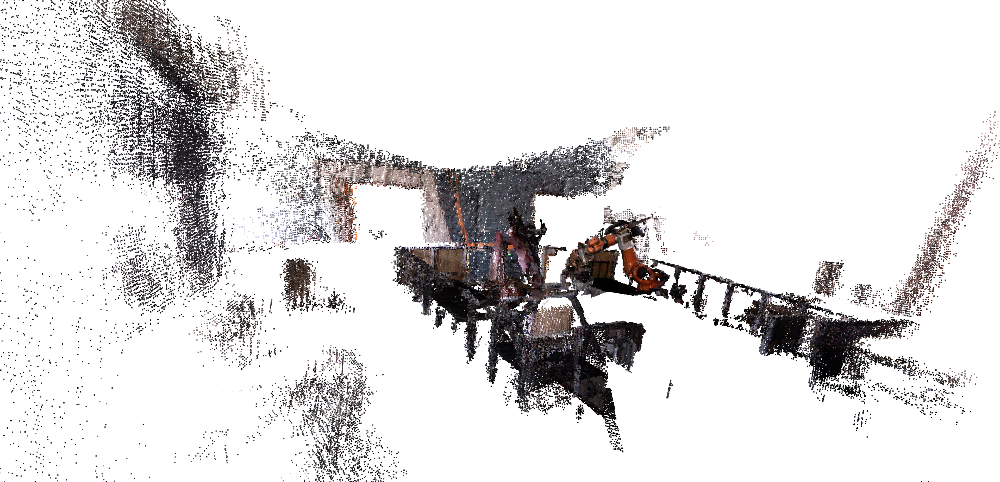

# workshop-raccoon-cv

### KUKA prc example files
[example_robot_programming_in_Rhino](https://drive.google.com/file/d/1kzzR0gK_d3wgkkV1yESv7XUb84CfU9Pq/view?usp=sharing)


### 0. ROS Setup
#### Ubuntu 20.04.6 LTS install of ROS Noetic
https://wiki.ros.org/noetic/Installation/Ubuntu

```
sudo apt install ros-noetic-rosbridge-server ros-noetic-ros-controllers ros-noetic-ros-control
mkdir -p catkin_ws/src
cd catkin_ws/src
git clone https://github.com/rccn-dev/compas_fab_backend.git
git clone https://github.com/rccn-dev/kuka_kr300_support.git
git clone https://github.com/rccn-dev/kuka_robot_driver_interfaces.git
git clone https://github.com/rccn-dev/rccn_robot_cell.git

# Official packages
git clone https://github.com/ros-planning/moveit_calibration.git
git clone https://github.com/introlab/rtabmap_ros.git
cd catkin_ws/src
rosdep install -y --from-paths . --ignore-src --rosdistro noetic
cd ..
catkin_make
source devel/setup.bash
roslaunch rccn_east_robot_moveit_config demo.launch
```


   

* rviz open

### 1. NUC IP Setup
192.168.1.221
'''
account:n76104052@192.168.1.221
password:Ncku54107

n76104052@ws-nuc-a:~/Projects/raccoon-cv$ export ROS_MASTER_URI=http://192.168.1.113:11311
n76104052@ws-nuc-a:~/Projects/raccoon-cv$ echo $ROS_MASTER_URI 
n76104052@ws-nuc-a:~/Projects/raccoon-cv$ roslaunch realsense2_camera rs_camera.launch 
'''

### 2. PC IP Setup

'''
export ROS_IP:=192.168.1.113
export ROS_MASTER_URI=http://192.168.1.113:11311

cd catkin_ws
source devel/setup.bash

roslaunch rccn_east_robot_kvp_moveit_config demo.launch #Make sure connected with Kuka
'''

### 3. Kuka Moveit Calibration
#### Open camera in NUC IP
'''
n76104052@ws-nuc-a:~/Projects/raccoon-cv$ roslaunch realsense2_camera rs_camera.launch 

or

roslaunch realsense2_camera rs_camera.launch color_width:=800 color_height:=600 color_fps:=15 camera:=cam_0 serial_no:=025222073397
'''
#### PC
'''
rosrun rqt_image_view rqt_image_view  #Read the screen from camera
'''
Calibration parameters adjustment such as the example in pictures (you should measure the ArUco Markers in the physical environment), setting sensor configuration: Eye-in-hand and and frame selection, sampling 20 different camera poses by moving KUKA manually. Save Camera Pose.

 

* calibration parameters


#### NUC
If you want to start the camera node and align the depth stream to other available streams such as color or infra-red for point-cloud scanning, please add 'align_depth:=true'.

'''
n76104052@ws-nuc-a:~/Projects/raccoon-cv$ roslaunch realsense2_camera rs_camera.launch color_width:=1280 color_height:=720 color_fps:=15 camera:=cam_0 serial_no:=025222073397 align_depth:=true
'''
#### ROS Core
Make sure roscore always running.

'''
roscore
'''

### 4. Parameters of calibration launch
#### Getting parameters from the 'Save Camera Pose' step in the picture 'calibration_parameters'

File Path: /home/raccoon_admin/Projects/raccoon_cv/catkin_ws_test/src/rccn_robot_cell/moveit_config/rccn_east_robot_kvp_moveit_config/launch/camera_tf.launch

#### Modifying parameters of 'args' by opening 'camera_tf.launch'
<launch>
  <!-- The rpy in the comment uses the extrinsic XYZ convention, which is the same as is used in a URDF. See
   	http://wiki.ros.org/geometry2/RotationMethods and https://en.wikipedia.org/wiki/Euler_angles for more info. -->
  <!-- xyz="-0.104779 -3.54855 -0.0582245" rpy="0.493805 0.386728 -1.7957" -->
  <node pkg="tf2_ros" type="static_transform_publisher" name="camera_link_broadcaster"
  	args="-0.104779 -3.54855 -0.0582245   0.0037842 0.303698 -0.714869 0.629854 east_tool0 cam_0_link" />
</launch>

#### Check the TF_tree
rqt_tf_tree is a runtime tool for visualizing the tree of frames being broadcast over ROS.

 

* TF trees

### 5. Start the scanning
'''
raccoon_admin@Ubuntu-Seney:~/Projects/raccoon_cv/catkin_ws_test$ roslaunch rccn_east_robot_kvp_moveit_config robot_scan.launch
raccoon_admin@Ubuntu-Seney:~/Projects/raccoon_cv/catkin_ws_test$ roslaunch rccn_east_robot_kvp_moveit_config camera_tf.launch
raccoon_admin@Ubuntu-Seney:~/Projects/raccoon_cv/catkin_ws_test$ roslaunch rccn_east_robot_kvp_moveit_config demo.launch
'''

### Utilizing the KUKA teach pendant in the scanning process
'''
Control+C to stop:
raccoon_admin@Ubuntu-Seney:~/Projects/raccoon_cv/catkin_ws_test$ roslaunch rccn_east_robot_kvp_moveit_config robot_scan.launch
'''
And you will get:
rtabmap: Saving database/long-term memory... (located at /home/raccoon_admin/.ros/rtabmap.db)
rtabmap: Saving database/long-term memory...done! (located at /home/raccoon_admin/.ros/rtabmap.db, 1377 MB)

 

* RACCOON point cloud scanning result
